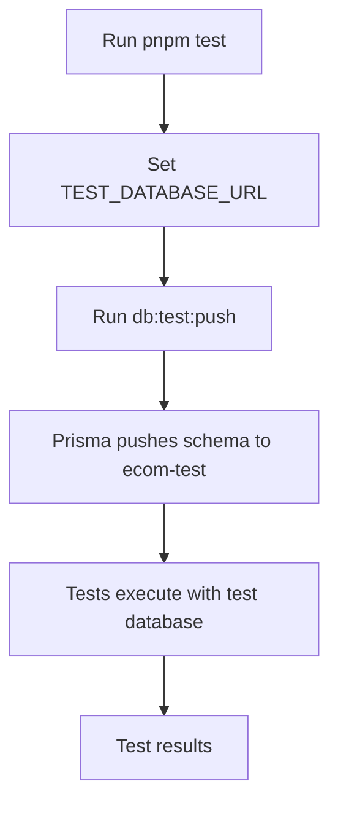

# Testing Guide

This guide explains how to run tests in the e-commerce project with a separate test database.

## Test Database Setup

The project uses a **separate test database** (`ecom-test`) on the same CockroachDB instance to avoid interfering with development data.

### Database Configuration

| Database    | Port  | Database Name | Usage             |
| ----------- | ----- | ------------- | ----------------- |
| Development | 26258 | `ecom-dev`    | Local development |
| Test        | 26258 | `ecom-test`   | Running tests     |

Both databases run on the same CockroachDB instance to save resources.

## Environment Variables

### Required Variables

Add the following to your `.env` file:

```bash
# Development Database
DATABASE_URL=postgresql://root@localhost:26258/ecom-dev?sslmode=disable

# Test Database (optional - has a default)
TEST_DATABASE_URL=postgresql://root@localhost:26258/ecom-test?sslmode=disable
```

**Note:** If `TEST_DATABASE_URL` is not set, it defaults to `postgresql://root@localhost:26258/ecom-test?sslmode=disable`

## Running Tests

### 1. Start the Database

Make sure CockroachDB is running:

```bash
pnpm db:start
```

This starts the main CockroachDB instance that will host both `ecom-dev` and `ecom-test` databases.

### 2. Initialize Test Database

Push the Prisma schema to the test database:

```bash
pnpm db:test:push
```

This command:

- Creates the `ecom-test` database if it doesn't exist
- Pushes the Prisma schema to the test database
- Does **not** run migrations (uses `db push` for speed)

### 3. Run Tests

```bash
pnpm test
```

This command:

1. Automatically runs `db:test:push` to ensure test database is up to date
2. Sets `TEST_DATABASE_URL` for all tests
3. Runs tests across all packages in parallel

### Run Tests in Specific Package

```bash
# Test only the API
pnpm --filter @ecom/api test

# Or using turbo
turbo test --filter=@ecom/api
```

### Run Tests in Watch Mode

```bash
cd apps/api
pnpm test
# Vitest will run in watch mode
```

## How It Works

### Test Database Isolation

1. **Separate Database**: Tests run against `ecom-test` instead of `ecom-dev`
2. **Same Instance**: Both databases share the same CockroachDB instance
3. **No Docker Overhead**: No need to spin up separate containers
4. **Fast Setup**: Uses `db push` instead of migrations

### Test Workflow



### Configuration Files

#### `package.json` (root)

```json
{
  "scripts": {
    "test": "TEST_DATABASE_URL=${TEST_DATABASE_URL:-...} pnpm with-env turbo test",
    "db:test:push": "DATABASE_URL=${TEST_DATABASE_URL:-...} pnpm --filter @ecom/database db:push"
  }
}
```

#### `turbo.json`

```json
{
  "tasks": {
    "test": {
      "dependsOn": ["db:test:push"],
      "cache": false
    },
    "db:test:push": {
      "inputs": ["prisma/schema.prisma"],
      "cache": false
    }
  }
}
```

#### `apps/api/vitest.config.js`

```javascript
// Override DATABASE_URL with TEST_DATABASE_URL for tests
if (process.env.TEST_DATABASE_URL) {
  process.env.DATABASE_URL = process.env.TEST_DATABASE_URL
}
```

## Database Management

### Reset Test Database

To reset the test database (useful when tests leave dirty data):

```bash
# Drop and recreate the test database
pnpm db:test:push --force-reset
```

### View Test Database

Open Prisma Studio for the test database:

```bash
DATABASE_URL=$TEST_DATABASE_URL pnpm --filter @ecom/database db:studio
```

### Seed Test Database (Optional)

If you need test data:

```bash
DATABASE_URL=$TEST_DATABASE_URL pnpm --filter @ecom/database db:seed
```

## Best Practices

### 1. Clean Database State

Tests should not depend on existing data:

```typescript
// Good: Create data in beforeEach
beforeEach(async () => {
  await prisma.product.create({ ... })
})

// Bad: Assume data exists
test('should find product', async () => {
  const product = await prisma.product.findFirst()
  expect(product).toBeDefined() // ❌ Flaky!
})
```

### 2. Clean Up After Tests

```typescript
afterEach(async () => {
  await prisma.product.deleteMany()
})

afterAll(async () => {
  await prisma.$disconnect()
})
```

### 3. Isolated Test Data

Use unique identifiers to avoid conflicts:

```typescript
test('should create product', async () => {
  const uniqueSlug = `product-${Date.now()}`
  const product = await createProduct({ slug: uniqueSlug })
  // ...
})
```

### 4. Transaction Rollbacks (Advanced)

For complete isolation, wrap tests in transactions:

```typescript
beforeEach(async () => {
  await prisma.$executeRaw`BEGIN`
})

afterEach(async () => {
  await prisma.$executeRaw`ROLLBACK`
})
```

## Troubleshooting

### Tests Fail with "Database doesn't exist"

Run:

```bash
pnpm db:test:push
```

### Tests Use Wrong Database

Check that `TEST_DATABASE_URL` is set:

```bash
echo $TEST_DATABASE_URL
```

Verify vitest config is loading it:

```bash
cat apps/api/vitest.config.js
```

### Test Database is Dirty

Reset the test database:

```bash
pnpm db:test:push --force-reset
```

### Tests are Slow

The first test run may be slow because:

1. Database needs to be pushed
2. Prisma client needs to be generated

Subsequent runs should be faster.

### Connection Issues

Verify CockroachDB is running:

```bash
docker ps | grep cockroach
```

If not running:

```bash
pnpm db:start
```

## CI/CD Integration

### GitHub Actions Example

```yaml
name: Tests

on: [push, pull_request]

jobs:
  test:
    runs-on: ubuntu-latest

    services:
      cockroach:
        image: cockroachdb/cockroach:latest-v24.2
        ports:
          - 26258:26257
        options: >-
          --health-cmd "curl -f http://localhost:8080/health || exit 1"
          --health-interval 10s
          --health-timeout 5s
          --health-retries 5

    steps:
      - uses: actions/checkout@v3

      - uses: pnpm/action-setup@v2
        with:
          version: 10.10.0

      - uses: actions/setup-node@v3
        with:
          node-version: '22'
          cache: 'pnpm'

      - name: Install dependencies
        run: pnpm install

      - name: Setup test database
        run: pnpm db:test:push
        env:
          TEST_DATABASE_URL: postgresql://root@localhost:26258/ecom-test?sslmode=disable

      - name: Run tests
        run: pnpm test
        env:
          TEST_DATABASE_URL: postgresql://root@localhost:26258/ecom-test?sslmode=disable
```

## Summary

- ✅ **Separate test database** on same CockroachDB instance
- ✅ **Automatic setup** via `db:test:push`
- ✅ **No Docker overhead** - uses existing instance
- ✅ **Fast execution** - db push instead of migrations
- ✅ **CI/CD ready** - easy to configure
- ✅ **Isolated testing** - won't affect dev data

Happy testing! 🧪
